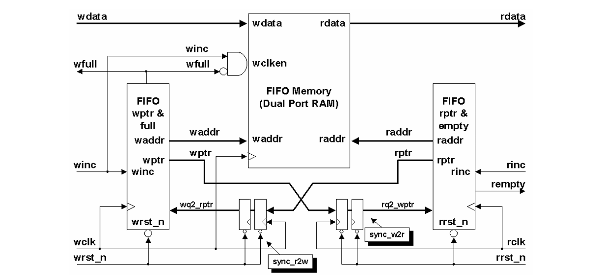
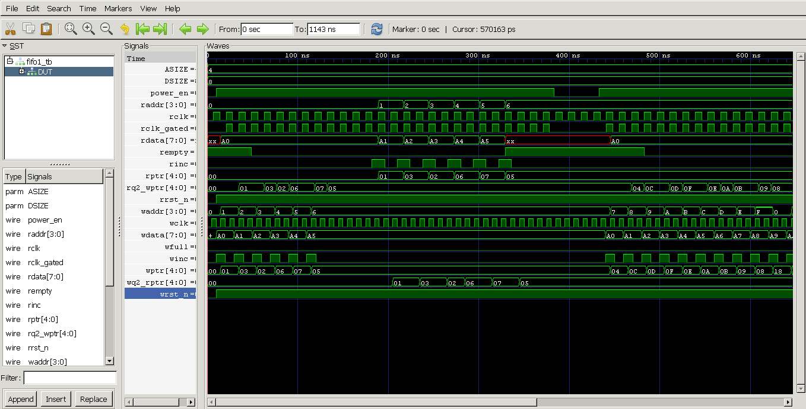
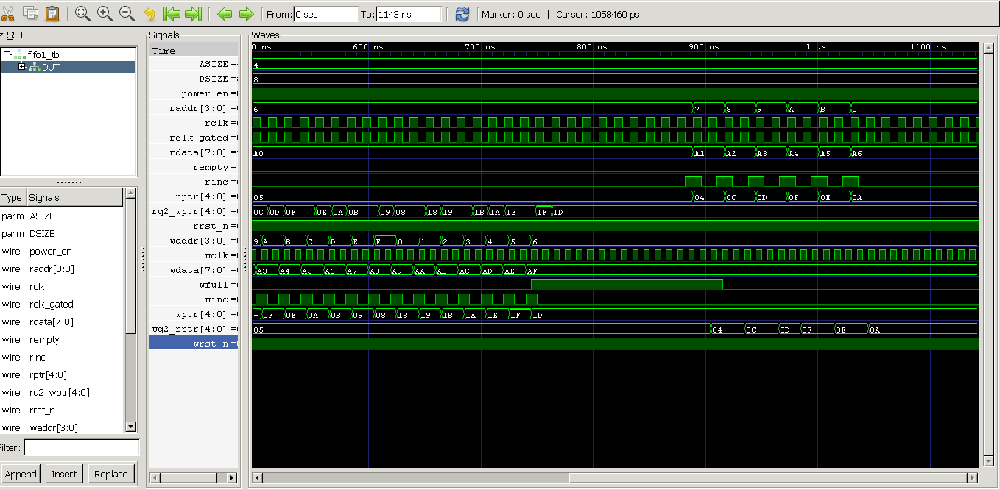
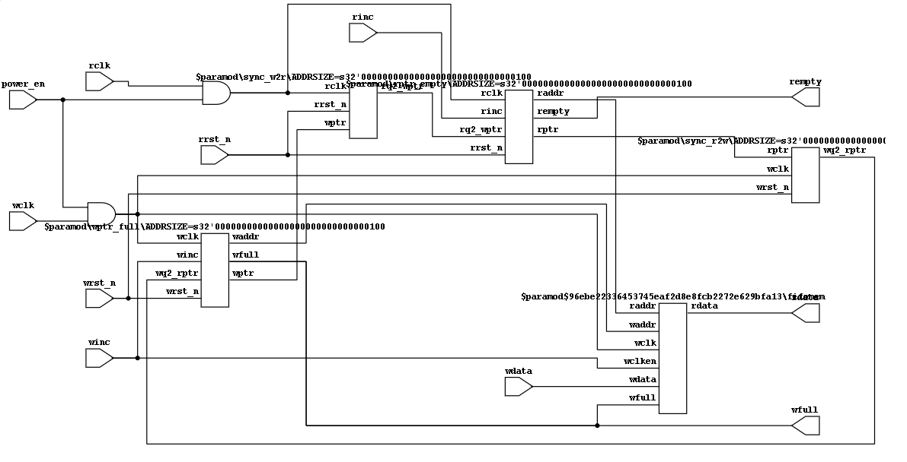

# Asynchronous FIFO Design

This repository contains an educational implementation of an asynchronous FIFO (First-In-First-Out) buffer design in Verilog. The design handles clock domain crossing between two independent clock domains, which is a common requirement in digital systems.

## Overview

An asynchronous FIFO is essential when data needs to be transferred between two clock domains operating at different frequencies or phases. This implementation addresses key challenges:

- **Clock Domain Crossing (CDC)**: Safe transfer of data and control signals between asynchronous clock domains
- **Gray Code Counters**: Used for read and write pointers to prevent metastability issues
- **Synchronization**: Multi-stage synchronizers to safely transfer pointer values across domains
- **Full/Empty Flag Generation**: Reliable indication of FIFO status
- **Clock Gating**:Low power design technique

## Features

- Parameterized FIFO depth and data width
- Gray code pointer implementation
- Two-stage synchronizers for CDC
- Empty and full flag generation

## Design Architecture

The design consists of:
1. **Write Domain Logic**: Write pointer management, full flag generation
2. **Read Domain Logic**: Read pointer management, empty flag generation
3. **Memory Array**: Dual-port RAM for data storage
4. **Synchronizers**: For safe pointer transfer between domains

### Block Diagram

### Simulation Waveforms

## Educational Purpose

This project is created for educational purposes to demonstrate:
- Asynchronous FIFO design principles
- Clock domain crossing techniques
- Gray code encoding/decoding
- Metastability prevention strategies
- RTL design best practices
- Low power design technique

### Open-Source Tools Used

This project utilizes the following open-source EDA tools for simulation, synthesis, and timing analysis:

- **Icarus Verilog**: Open-source Verilog compiler and simulator for functional verification
- **GTKWave**: Waveform viewer for analyzing simulation results and debugging
- **Yosys**: Open synthesis suite for synthesizing RTL to gate-level netlists
- **OpenSTA**: Static timing analysis tool for verifying timing constraints

## Acknowledgments

This implementation is based on concepts and techniques described in the following research papers and technical articles:

1. **Clifford E. Cummings** - "Simulation and Synthesis Techniques for Asynchronous FIFO Design" (SNUG 2002)
   - This seminal paper provides comprehensive coverage of asynchronous FIFO design methodologies
   - Available at: http://www.sunburst-design.com/papers/

2. **Clifford E. Cummings & Peter Alfke** - "Simulation and Synthesis Techniques for Asynchronous FIFO Design with Asynchronous Pointer Comparisons" (SNUG 2002)
   - Detailed analysis of pointer comparison techniques in async FIFOs

3. Various academic papers and resources on:
   - Clock domain crossing (CDC) techniques
   - Gray code counters
   - Metastability and synchronization

## Disclaimer

This is an **educational project** developed for learning purposes. The design concepts and techniques are derived from publicly available research papers and technical literature in the field of digital design. All original authors and sources are acknowledged above.

This implementation should be thoroughly verified and validated before use in any production environment.

## License

This project is licensed under the MIT License - see the LICENSE file for details.

## Contributing

This is an educational project. Suggestions and improvements are welcome!

## Contact

For questions or discussions about this implementation, please open an issue in this repository.

---

**Note**: This project is for educational purposes only. Proper citation and acknowledgment of all referenced sources have been provided to respect intellectual property and copyright.
